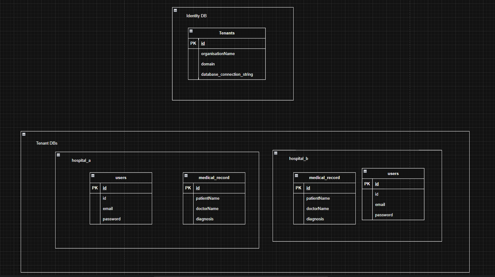

# Multi-Tenant App Demo

An application supporting "multiple dbs, one app" style of multi-tenancy.

## Database Diagram



## Request flow

1. User logs in with credentials
2. Credentials are identified via their email domain
3. tenant id is encoded in the JWT
4. Middleware is used to attach an existing db connection pool based on tenant id
5. Users only write to and read from their respective tenant dbs


## Directory structure

```sh
├── index.js
├── package.json
├── pnpm-lock.yaml
├── README.md
├── routing
│   └── routes.js
├── services
│   ├── Auth.js
│   ├── Database.js
│   └── MedicalRecord.js
└── utils
    └── env.js
```

